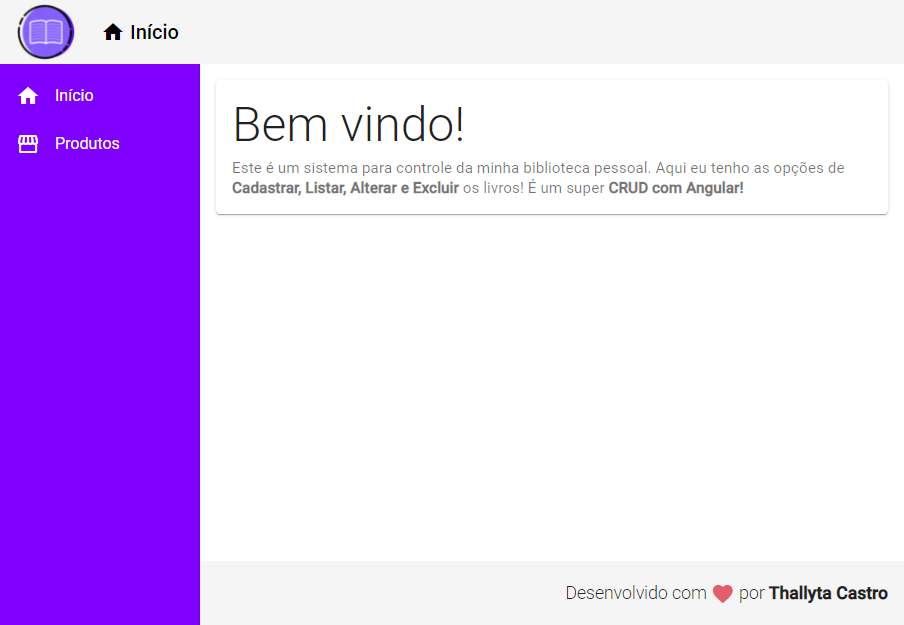
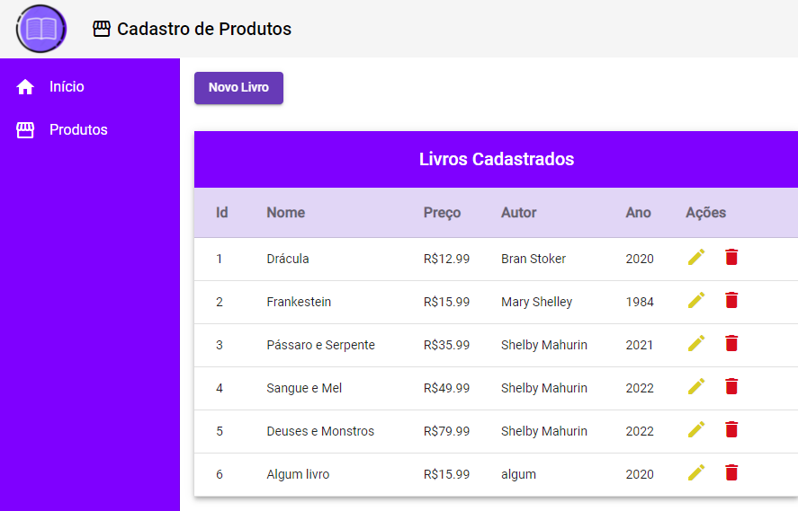
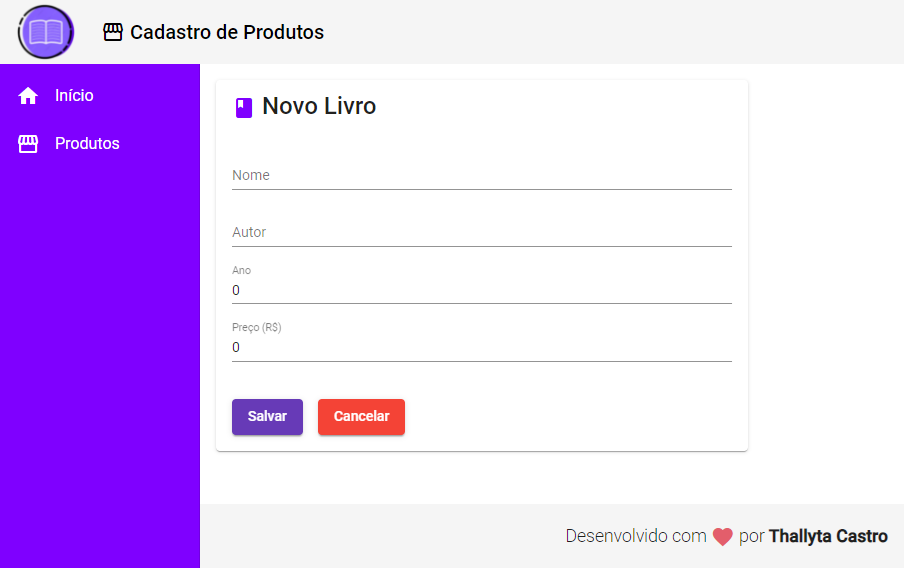

# Library Books Angular

<b> Este projeto foi criado para colocar em prática o aprendizado sobre recursos essenciais do Angular </b>

# Sobre o projeto
Este projeto consiste em uma aplicação simples em Angular de uma biblioteca que consome uma base de dados do arquivo db.json e realiza as quatro principais operações em banco de dados e 
e aplicativos: CREATE, READ, UPDATE E DELETE (CRUD). 

# Layout do projeto

# Tecnologias utilizadas
## Frontend

* HTML
* CSS 
* Javascript
* Typescript 4.5.2
* Angular CLI 13.2.3
* Angular Material 13.2.2
* Node
* NPM

## Backend

* json-server

Para iniciar a base de dados execute o seguinte comando na pasta backend: 

# Autor
<b>Thallyta Macedo Carvalho de Castro</b>

Linkedin: https://www.linkedin.com/in/thallyta-castro/

Medium: https://medium.com/@thallyta-castro-cv

email: contato@thallytacastro.com.br
